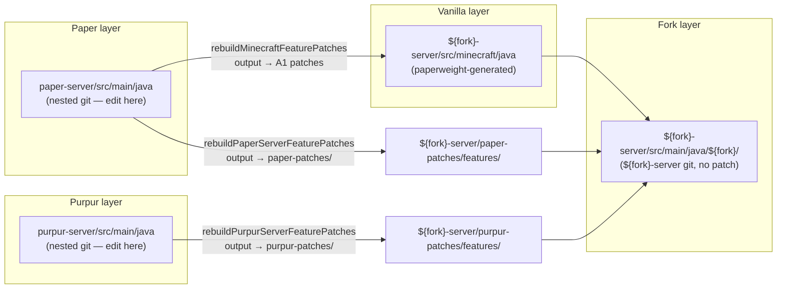
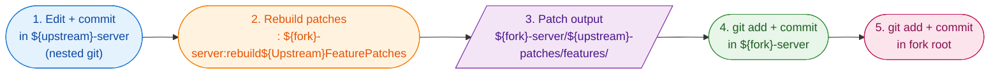
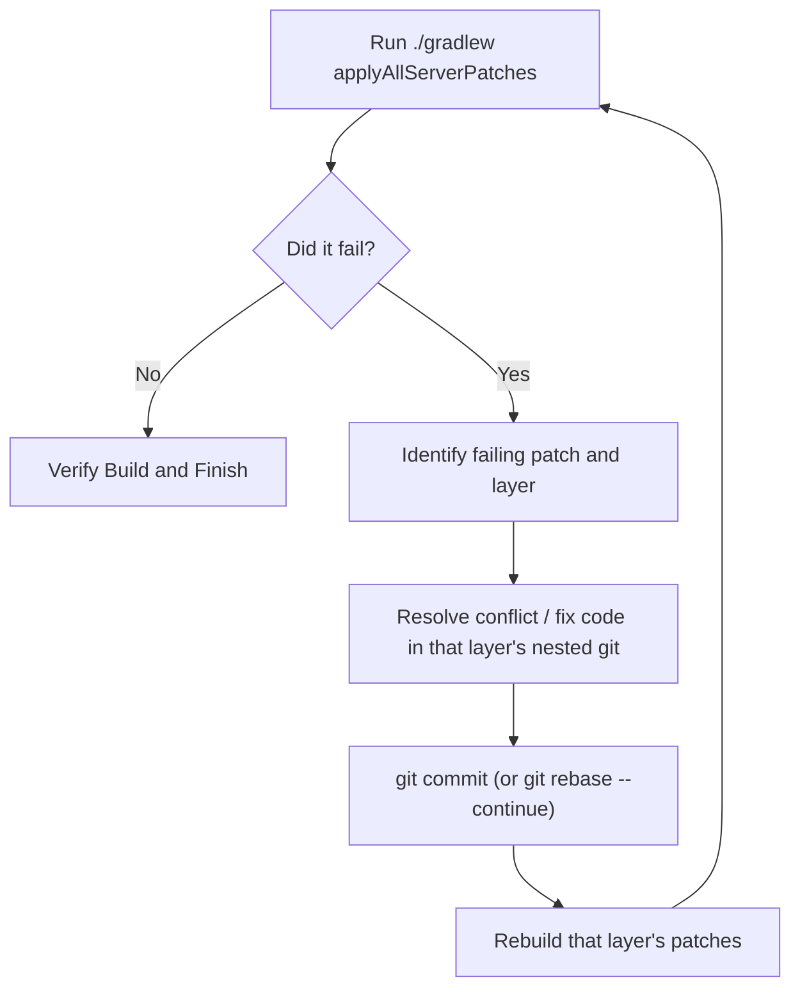

# Minecraft Paperweight Patching

A typical Minecraft server fork is built on top of upstream source trees
(**Paper → Purpur → ... → your fork**), using Paperweight
v2.0.0-beta.19 or compatible. Each upstream lives in its own subproject
as a nested git repo (`paper-server/`, `purpur-server/`); the fork
subproject (`<fork>-server/`) consumes their source via paperweight and
stores all generated patches locally.

This skill covers the three flows that drive day-to-day fork work:

- **Flow 1 — Modify upstream source** (`<upstream>-server/src/main/java/`):
  edit → commit inside the **upstream**'s nested git → run a fork-scoped
  rebuild task → the resulting patch lands in
  `<fork>-server/<upstream>-patches/features/` → commit it in the fork
  subproject → root-repo commit.
- **Flow 2 — Modify custom fork code**
  (`<fork>-server/src/main/java/<fork>/`): commit directly to the fork's
  git repo, then update the root-repo pointer. No patch involved.
- **Flow 3 — Bump the upstream reference** (e.g. `paperRef` or
  `purpurRef` in `gradle.properties`): re-apply patches, then resolve any
  per-layer failures and rebuild.

The naming convention is `<upstream>-patches/` (e.g. `paper-patches/`,
`purpur-patches/`), not `<fork>-patches/` — the patch output dir is
named after the upstream whose diff it captures, but it lives inside
`<fork>-server/`.

## How it works (overview)



Patch application order is strict and one-way. **Source edits happen
inside the upstream subproject's nested git repo** (`<upstream>-server/`);
**patch output lands inside the fork subproject**
under `<fork>-server/<upstream>-patches/features/`.

```
<fork>-server/
├── minecraft-patches/features/    # Vanilla paperweight patches
├── paper-patches/features/        # Paper patches (output of rebuilding Paper source)
├── purpur-patches/features/       # Purpur patches
├── <upstream>-patches/features/   # ... one dir per upstream layer
└── src/main/java/<fork>/          # Custom fork code
```

## Fork structure

| Directory            | Git             | Purpose                                              |
|----------------------|-----------------|------------------------------------------------------|
| `<fork>-server/`     | root repo       | Fork server subproject — **owns all patch dirs**     |
| `<fork>-api/`        | root repo       | Fork API subproject                                  |
| `paper-server/`      | nested git      | Paper upstream source (editable in Flow 1)           |
| `paper-api/`         | nested git      | Paper API                                            |
| `purpur-server/`     | nested git      | Purpur upstream source (editable in Flow 1)          |
| `purpur-api/`        | nested git      | Purpur API                                           |

Replace `<fork>` with your fork's slug (e.g. `tuinity`, `purpur`,
`divinemc`, etc.). The naming convention is consistent across most forks.

### Nested source repositories (per layer)

Each upstream subproject is a separate nested git repo at the root,
holding its full source tree at `src/main/`. The fork's patch output
sits inside `<fork>-server/`.

```
<fork>-server/
├── src/main/java/<fork>/            # Custom fork code (<fork>-server git)
├── minecraft-patches/features/      # Vanilla patches (<fork>-server git)
├── paper-patches/features/          # Paper patches (<fork>-server git)
├── purpur-patches/features/         # Purpur patches (<fork>-server git)
├── <upstream>-patches/features/     # ... one dir per upstream layer
└── src/minecraft/java/              # Vanilla decompiled (paperweight-generated)

paper-server/
└── src/main/                        # Paper upstream source (nested git — edit target)

purpur-server/
└── src/main/                        # Purpur upstream source (nested git — edit target)
```

### Patch application order

```
Vanilla (decompiled mojang source)
  → Paper (paper-server/src/main/ — edits committed in paper-server git)
  → Purpur (purpur-server/src/main/ — edits committed in purpur-server git)
  → <fork> (<fork>-server/src/main/java/<fork>/)
```

Each `<upstream>-patches/features/` dir inside `<fork>-server/` holds the
patches applied at its corresponding stage in this chain. Vanilla
patches live in `minecraft-patches/`; Paper edits go into `paper-patches/`;
Purpur edits go into `purpur-patches/`; the fork's own customizations
are layered on top in the fork subproject.

Each fork subproject (`<fork>-api`, `<fork>-server`) also carries a
`build.gradle.kts.patch` that modifies its upstream build file at build
time.

## Layer → source → rebuild task → patch dir

The **source** column points at the upstream subproject's nested git
where Flow 1 edits happen. The **patch dir** column points at the fork
subproject where the rebuild task writes its output.

| Layer             | Source directory                       | Rebuild task                                                | Patch dir                                              |
|-------------------|----------------------------------------|-------------------------------------------------------------|--------------------------------------------------------|
| Vanilla/Minecraft | `<fork>-server/src/minecraft/java/` (paperweight-generated) | `./gradlew :<fork>-server:rebuildMinecraftFeaturePatches`   | `<fork>-server/minecraft-patches/features/`            |
| Paper             | `paper-server/src/main/java/`          | `./gradlew :<fork>-server:rebuildPaperServerFeaturePatches` | `<fork>-server/paper-patches/features/`                |
| Purpur            | `purpur-server/src/main/java/`         | (covered by `rebuildAllServerPatches`)                      | `<fork>-server/purpur-patches/features/`               |
| Fork custom       | `<fork>-server/src/main/java/<fork>/`  | **No rebuild needed** (no patch)                            | —                                                      |

To rebuild every layer at once: `./gradlew rebuildAllServerPatches`.

> Note: All `<upstream>-patches/` directories live inside `<fork>-server/`,
> regardless of which upstream layer they belong to. The dir name is
> `<upstream>-patches/` (e.g. `paper-patches/`, `purpur-patches/`), not
> `<fork>-patches/`.

## Build commands

```sh
# First-time setup
./gradlew applyAllServerPatches && ./gradlew createMojmapPaperclipJar

# Quick compile-only check (no jar)
./gradlew :<fork>-server:compileJava
```

Always run `./gradlew :<fork>-server:compileJava` (or the full jar build)
before committing or rebuilding patches. Never commit untested code.

## Access rules for paperweight-managed paths

The following paths are managed by paperweight and are typically `.gitignore`d.
They are useful for understanding upstream behavior, debugging, and locating
call sites — **never the destination for persistent changes**.

| Path                                                                 | Permitted access |
|----------------------------------------------------------------------|------------------|
| `paper-server/src/main/`, `purpur-server/src/main/`, `paper-server/src/generated/`, `paper-server/src/test/` | Read + temporary edit (Flow 1 — upstream source, edit target) |
| `<fork>-server/src/minecraft/*`                                      | Read + temporary edit (Flow 1 — upstream source, edit target) |
| `<fork>-server/<upstream>-patches/features/` (e.g. `minecraft-patches/`, `paper-patches/`, `purpur-patches/`) | Read + commit (the authoritative location for fork-generated patch output) |
| `<fork>-server/src/main/java/<fork>/`                                | Read + write (Flow 2 — custom fork code) |
| `.gradle/caches/paperweight/`                                        | Read-only |
| `build/`, `bin/`, `<fork>-server/native/target/`                    | Read-only |

**Why read-only by default:** Editing a paperweight-managed mirror looks
authoritative but the change silently vanishes on the next
`./gradlew applyAllServerPatches` — the file is regenerated from the
upstream source + applied patches. Always translate insights into a
change in the authoritative location:

- Upstream source change (e.g. tweak Paper behavior) → commit in
  `<upstream>-server/src/main/java/` (the upstream subproject's nested
  git, e.g. `paper-server/src/main/java/`), then rebuild — the patch
  lands in `<fork>-server/<upstream>-patches/features/`.
- Custom fork Java → `<fork>-server/src/main/java/<fork>/`.

> **`<upstream>-server/src/main/java/` is the Flow 1 scratch space.**
> Edit a file there, commit inside that upstream's nested git, then run
> the matching rebuild task to convert the diff into a `.patch` file
> under the fork's `<upstream>-patches/features/`.

---

## Flow 1 — Modify upstream source

When modifying upstream source, you edit **inside the upstream
subproject's nested git**, then rebuild the patches into the fork
subproject. Four steps:

**Step 1 — Commit in the upstream's nested git repo**
(`<upstream>-server/src/main/java/`):

```bash
# Example for the vanilla layer (decompiled mojang source lives in the fork's mirror)
cd <fork>-server/src/minecraft/java
git add net/minecraft/world/entity/Entity.java
git commit -m "feat: ..."

# Example for the paper layer — edit Paper's source in Paper's own nested git
cd paper-server/src/main/java
git add net/minecraft/server/level/ServerLevel.java
git commit -m "fix: ..."

# Example for the purpur layer — edit Purpur's source in Purpur's own nested git
cd purpur-server/src/main/java
git add org/purpurmc/purpur/.../SomeFile.java
git commit -m "fix: ..."
```

**Step 2 — Rebuild patches** from the **fork subproject root** — the
rebuild task generates the diff against upstream and writes it into
`<fork>-server/<upstream>-patches/features/`:

```bash
# Use the specific task for the layer you modified
./gradlew :<fork>-server:rebuildMinecraftFeaturePatches    # Vanilla
./gradlew :<fork>-server:rebuildPaperServerFeaturePatches  # Paper
./gradlew rebuildAllServerPatches                          # All layers
```

> Patch generation only picks up **committed** changes. Uncommitted edits
> in the upstream's nested git are silently dropped from the regenerated
> patches.

**Step 3 — Commit the generated patch in the fork subproject**:

```bash
cd <fork>-server
# The patch output dir is named after the upstream that produced it
git add paper-patches/features/00XX-*.patch        # if you edited Paper
git add purpur-patches/features/00XX-*.patch       # if you edited Purpur
git add minecraft-patches/features/00XX-*.patch    # if you edited vanilla
git commit -m "feat: add patch for ..."
```

**Step 4 — Update the root repo** (fork-subproject pointer):

```bash
cd /path/to/fork-root
git add <fork>-server
git commit
```

### Commit flow diagram



**Shape legend:**

- `([stadium])` — action you run (git commit, gradle rebuild).
- `[/parallelogram/]` — file artifact on disk (the generated patch).

**Step locations:**

1. **Edit + commit** happens in the **upstream** subproject's nested git.
2. **Rebuild patches** runs from the fork subproject root (`${fork}-server`).
3. **Patch output** lands in `${fork}-server/${upstream}-patches/features/`.
4. **Commit the patch** happens in the fork subproject git.
5. **Root-repo pointer** update happens in the fork root repo.

### Verifying after a Flow 1 change

```sh
# Quick sanity
./gradlew :<fork>-server:compileJava

# Full jar (slower, end-to-end)
./gradlew createMojmapPaperclipJar
```

If either fails, fix the source in the upstream's nested git and recommit
— do **not** edit the generated `<fork>-server/src/minecraft/java/`
files directly as a "fix".

---

## Flow 2 — Modify custom fork code

Changes to `<fork>-server/src/main/java/<fork>/` go **directly** to the
`<fork>-server` git repo — no patch, no rebuild task, no nested git.

```bash
cd <fork>-server
git add src/main/java/<fork>/
git commit -m "feat: ..."
# Then update the root
cd /path/to/fork-root
git add <fork>-server
git commit
```

Verify with `./gradlew :<fork>-server:compileJava` or the full
`./gradlew createMojmapPaperclipJar`.

---

## Flow 3 — Bump the upstream reference

The upstream reference lives in the root `gradle.properties`. Common keys
include `paperRef`, `purpurRef`, or fork-specific names like `divineRef`,
`tuinityRef`. Bumping it pulls in newer upstream commits, which may break
existing patches.

**Step 1 — Update the reference:**

```bash
# Edit gradle.properties and set the ref key to the target commit hash
paperRef=NEW_COMMIT_HASH
```

**Step 2 — Re-apply patches:**

```bash
./gradlew applyAllServerPatches
```

- If it succeeds → run `./gradlew createMojmapPaperclipJar` to confirm
  the build still works. Done.
- If it fails → enter the per-layer fix loop.

### The one-at-a-time fix loop (repeat until clean)



**Step 1 — Identify the failing patch.** Read the
`applyAllServerPatches` output to see which patch (e.g.
`0005-some-patch.patch`) and which upstream layer it belongs to (Vanilla
/ Paper / Purpur). The fix lives in the upstream subproject's nested
git — e.g. Paper patches fail in `paper-server/src/main/java/`, Purpur
patches fail in `purpur-server/src/main/java/`, vanilla patches are
diffed in `<fork>-server/src/minecraft/java/`.

**Step 2 — Resolve the failure.** Three cases:

- **Rejected hunks (`.rej` files):**
  1. Find them: `find . -name "*.rej"`.
  2. Inspect each `.rej` and manually apply the hunks into the target
     source, adapting to the new upstream structures.
  3. **Always delete the `.rej` files** once applied:
     ```bash
     rm <path-to-rej-file>
     ```
  4. Continue:
     ```bash
     git add <modified-files>
     git rebase --continue
     ```

- **Git conflict (standard rebase block):**
  1. Identify conflicted files (containing `<<<<<<<`, `=======`,
     `>>>>>>>`).
  2. Resolve carefully — preserve downstream features, refactor them to
     match the new upstream APIs.
  3. Continue:
     ```bash
     git add <resolved-files>
     git rebase --continue
     ```

- **Post-rebase compilation blocker (API mismatch):**
  1. Apply the necessary code modifications directly in the nested
     source tree.
  2. Verify, then commit as a temporary fix:
     ```bash
     git add <modified-files>
     git commit -m "Temp fix for patch X"
     ```

**Step 3 — Squash the fix into the failing patch commit** (no dirty fix
commits allowed in history):

```bash
git rebase -i HEAD~N   # N is typically 2 or 3
```

Move the temp fix line directly below the failed patch commit and change
`pick` → `f` (fixup) or `s` (squash). Save and close — git folds the
change into the original patch commit.

**Step 4 — Rebuild that layer's patches** from the root:

```bash
./gradlew :<fork>-server:rebuildMinecraftFeaturePatches    # if Vanilla layer
./gradlew :<fork>-server:rebuildPaperServerFeaturePatches  # if Paper layer
./gradlew rebuildAllServerPatches                          # all layers at once
```

**Step 5 — Retry** `./gradlew applyAllServerPatches`. If a deeper patch
fails, repeat from Step 1. Loop one-by-one until applyAllServerPatches
runs clean.

**Step 6 — Verify the build** with `./gradlew createMojmapPaperclipJar`.

---

## Helper scripts

Bundled under `scripts/` (relative to the skill folder). Run them from
the fork root.

| Script                          | Purpose                                                                                                |
|---------------------------------|--------------------------------------------------------------------------------------------------------|
| `scripts/rebuild-patches.sh`    | Rebuild patch files from subproject commits. **Fails fast if any subproject has uncommitted changes** — prevents the "uncommitted edits silently dropped from regenerated patches" footgun. Usage: `scripts/rebuild-patches.sh` (server) or `scripts/rebuild-patches.sh api`. |
| `scripts/find-patch-failures.sh` | After a failed `applyAllPatches`, reports where it broke: `*.rej` files, files with unresolved `<<<<<<<` markers, and subproject git repos with dirty state. Read-only. |
| `scripts/clean-gradle.sh`       | Corrupt Gradle state fix: stops the daemon, removes `.gradle`. Pass `--apply` (or `-a`) to chain `applyAllPatches` automatically. |

> These scripts use the generic paperweight task names
> (`applyAllPatches`, `rebuildAllServerPatches`, `rebuildAllApiPatches`).
> The fork's per-layer tasks (`:<fork>-server:rebuildMinecraftFeaturePatches`,
> `applyAllServerPatches`, etc.) work the same way but are scoped to a
> single layer.

---

## Corrupt Gradle state

If patch application or a build fails with errors about **broken
objects**, a **corrupt ancestor**, or a corrupt Gradle cache:

1. **Targeted fix**: `./gradlew cleanCache` — clears the paperweight
   setup cache and task outputs (`.gradle/caches/paperweight`).
2. **If still broken, go nuclear**: stop the daemon, then remove
   `.gradle`:
   ```bash
   ./gradlew --stop
   rm -rf .gradle
   ```
3. **Re-apply patches**: `./gradlew applyAllServerPatches`.

---

## Hard rules

1. **NEVER edit the paperweight-generated mirror
   (`<fork>-server/src/minecraft/java/`) directly as a fix.** The
   authoritative edit location for upstream source is the upstream
   subproject's `src/main/java/` (`paper-server/src/main/java/`,
   `purpur-server/src/main/java/`). The mirror inside `<fork>-server/`
   is regenerated on every `applyAllServerPatches`.
2. **NEVER skip the nested-git commit.** It stores the actual source
   change; the rebuild step only sees committed diffs.
3. **Always rebuild patches** after committing in an upstream's
   nested git — the rebuild task regenerates the `.patch` file under
   `<fork>-server/<upstream>-patches/features/`.
4. **Verify before committing**: run
   `./gradlew :<fork>-server:compileJava` or
   `./gradlew createMojmapPaperclipJar` and confirm it passes before
   claiming a change is done.
5. **Respect the fork hierarchy**: apply changes only at the layer that
   owns them. Your fork's patches go on top of upstream, not in the
   upstream layers.
6. **Keep diffs surgical**: minimize formatting-only changes in upstream
   source — they create merge pain on every upstream bump.

## Configuration

- `gradle.properties` — version, MC version, upstream ref keys (e.g.
  `paperRef`, `purpurRef`), JVM args.
- `.editorconfig` — code style settings.
